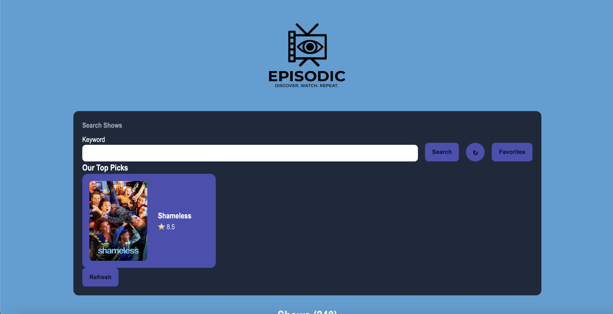
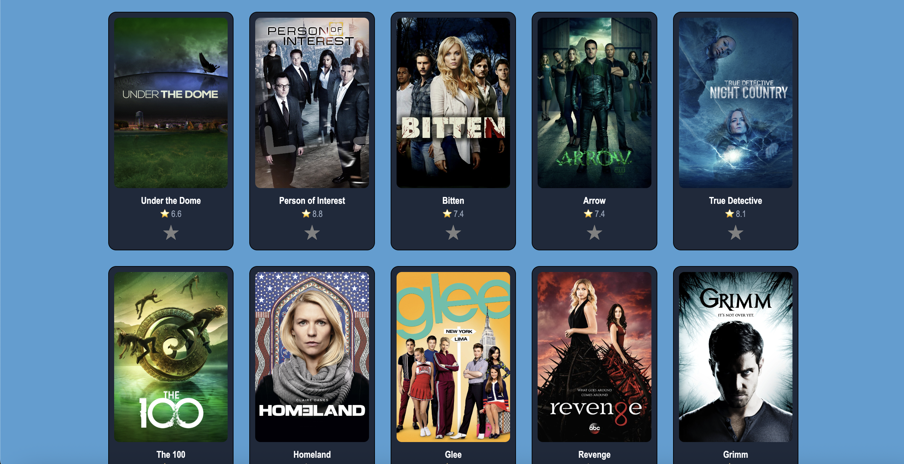
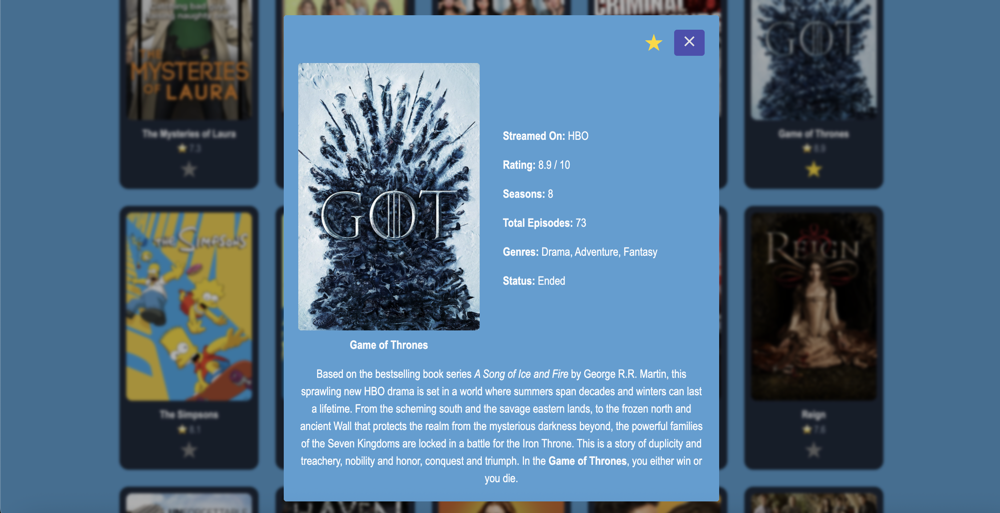
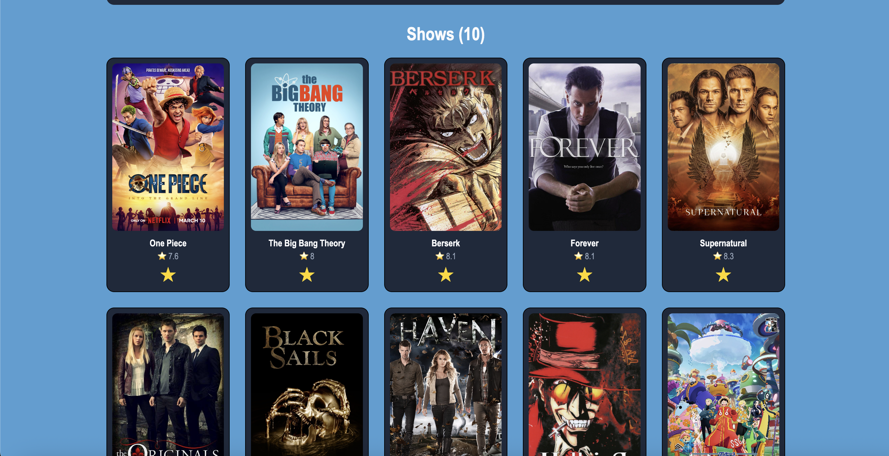

# Episodic

## What's Episodic?
Episodic: a web application built using the TVMaze API for show fanatatics to explore and save their favorite shows.

## API endpoints

We used four different endpoints:
1. https://api.tvmaze.com/shows to fetch a collection of shows.
2. https://api.tvmaze.com/search/shows?q={query} to implement a search feature.
3. https://api.tvmaze.com/shows/{id} to get details about a specific show.
4. https://api.tvmaze.com/shows/{id}/episodes to get number a show's episodes data.

## Features 

### MVP Features

- Users will be able to see a search section as well as a grid of different TV shows when they load the page.
- Users will be able to search for a specific TV show given a keyword (query).
- Users will be able to do a new search and reset it.
- Users will be able to click on a TV show to see more details about it and be able to click on a close button to go back.

### Stretch Features

- Users will be able to add a show to their **favorites** list using localStorage
- Users will be able to get a new random pick with shows of rating 8 or more.

## Setup instructions

When you clone this repo:

1. Run `npm install` to install necessary dependencies.

2. Run `npm run dev`

## Image Walkthrough

Search a show by keywork, access your favorites list, or get a random show pick.

Browse and explore different shows.

Click on a show to view its details.

Favorite your favorite shows to reference later!

## AI Usage

This project provided me an opportunity to build something with AI assistance. Check out my [AI Usage Document](https://docs.google.com/document/d/1y6scq8dqKQW6UxnIsD1iaBMLIBVz43eInrTqBu9rekk/edit?usp=sharing) to see how I used AI on this project.

## Technologies Used
- JavaScript
- HTML5
- CSS3
- Vite